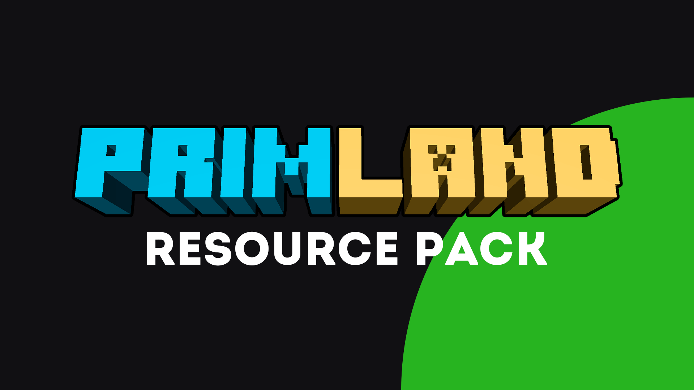
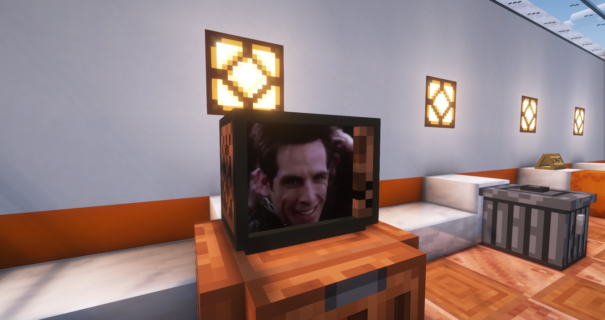

# Ресурс пак
 <!-- TODO: нормальный баннер -->

<p class="mod-links">
    <a class="reference external" target="_blank" href="https://modrinth.com/resourcepack/primland-rp/versions" rel="nofollow noopener">
        Скачать
        <svg xmlns="http://www.w3.org/2000/svg" fill="currentColor" height="1em" width="1em" stroke="none" viewBox="0 0 24 24"><path d="m13 3 3.293 3.293-7 7 1.414 1.414 7-7L21 11V3z"></path><path d="M19 19H5V5h7l-2-2H5c-1.103 0-2 .897-2 2v14c0 1.103.897 2 2 2h14c1.103 0 2-.897 2-2v-5l-2-2v7z"></path></svg>
    </a>
</p>

Данный ресурс пак создан основателем и владельцем сервера - 
<a class="reference external" target="_blank" href="https://discord.com/users/985301325153730580" rel="nofollow noopener">
    @PrimotOff
    <svg xmlns="http://www.w3.org/2000/svg" fill="currentColor" height="1em" width="1em" stroke="none" viewBox="0 0 24 24"><path d="m13 3 3.293 3.293-7 7 1.414 1.414 7-7L21 11V3z"></path><path d="M19 19H5V5h7l-2-2H5c-1.103 0-2 .897-2 2v14c0 1.103.897 2 2 2h14c1.103 0 2-.897 2-2v-5l-2-2v7z"></path></svg>
</a>

## Описание
Данный ресурс пак добавляет 200+ тематических предметов, работающих через переименования.
Здесь есть куча предметов, например, элементы брони, мечи, щиты и другие. Также в нём
есть предметы из разных вселенных фильмов и игр, таких как: FNAF, Звёздные Войны,
PayDay 2, Человек бензопила, Portal 2, Смешарики, JoJo, Genshin Impact, Terraria,
Brawl Stars.


Кстати, есть и предметы, связанные с историей проектов Primland и Primburg: Тотемы
игроков сервера, статуи в честь кланов, cкалк-броня, несколько картин, шахматные фигуры
с ивента и многие другие.


Есть и предметы для украшения локаций таких как: аквариум, таблички открыто/закрыто,
телевизор, мусорка и подобные.
 <!-- TODO: Заменить на видео -->

Вы можете использовать данный ресурс пак как для создания красивых, антуражных
скриншотов, так и для обычной игры для разнообразия своего геймплея.

## Эмодзи в чате
<!-- TODO: Скриншот/видео -->

Также данный ресурс пак добаляет эмоджи в чат. Вы можете посмотреть их полный список,
прописав `/emojis`

## Тотемы


Наш ресурс пак добавляет тотемы со скинами игроков (и не только). Хотите, чтобы мы
добавили тотем с Вашим скином? Вы можете этого добиться, попав в топ-10 по времени
игры на сервере... или просто купив 
<a class="reference external" target="_blank" href="https://shop.primland.fun" rel="nofollow noopener">
    <strong>Prim</strong>/<strong>Prim+</strong>
    <svg xmlns="http://www.w3.org/2000/svg" fill="currentColor" height="1em" width="1em" stroke="none" viewBox="0 0 24 24"><path d="m13 3 3.293 3.293-7 7 1.414 1.414 7-7L21 11V3z"></path><path d="M19 19H5V5h7l-2-2H5c-1.103 0-2 .897-2 2v14c0 1.103.897 2 2 2h14c1.103 0 2-.897 2-2v-5l-2-2v7z"></path></svg>
</a>
||(нет, ну а что, должны же мы на что-то жить :P)||

```{toctree}
:maxdepth: 2
:hidden:

resource_pack/renames
```